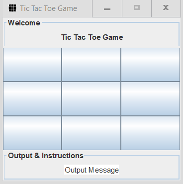

#### What is this project about ?

This is a Tic Tac Toe project written in Java on IntelliJ IDE using a graphical user interface to show player and computer moves.


#### How is the game played ?

Tic Tac Toe is a User Vs. Computer game, with a 3 x 3 grid of Java buttons. Computer is always X, Player is always O. Computer takes first turn upon game start. Player is next, after player makes a move, computer will make his move, and so on, until there is a winner or no one wins.

#### How does the computer make a move ?
The computer moves are made through random numbers generated using Java's Math class. A random number is generated from 1 to 9.

``` rand1 = (int) (grid.getWidth() * Math.random());  // grid width is 3 ```

``` rand2 = (int) (grid.getHeight() * Math.random());  // grid height is 3 ```

If that tile on the grid is available for play, an X is placed. Otherwise, we keep trying to generate a new number, until we find an empty tile or the game is over.

###### Pros of random  numbers :
1. User cannot predict computer's next move


###### Cons of random numbers :
1. Computer does not necessarily win


#### How does the program alternate turns between User and Computer ?

First, the program is made such that the computer makes the first move by marking one tile with X. After that, the program will _wait_ for the user to play. After the user makes a move, **only then** the computer can make a move. How is this accomplished with code ? Okay, well there is something in Java called _Synchronization_, with this feature, we can synchronize two blocks of code, one block will have the "wait" method called, this method will stop the execution of any code that succeeds it, until the second block of code which will have the "notify" method called, once this method is executed, the program continues to execute the source code following the "wait" method call.

The following block of code starts with a synchronization statement, and in the middle there is a `wait();` statement. 

```java
synchronized (this) {
    while (true) {
        computerPlay();
        if (isWinner() == 0) {
            output.setText("Computer Won");
            disableButtons();
            break;
        }

        //debugging line
        //System.out.println("inside play method ( Computer Played )");

        // releases the lock on shared resource
        wait();

        //debugging line
        // and waits till some other method invokes notify().
        System.out.println("User clicked the panel,resumed play method( Computer Turn )");
    }
}
```


Next, the player has to play, once finished, we `notify();` the calling the process that called the `wait();` method to continue execution, like so:


```java
synchronized (this) {    
    Object whichButton = ae.getSource();    
    for (int i = 0; i < grid.getWidth(); i++) {        
        for (int j = 0; j < grid.getHeight(); j++) {            
            if (whichButton == grid.getButton()[i][j]) {                
                if ((grid.getButton()[i][j].getText()).equals("X") || (grid.getButton()[i]					[j].getText()).equals("O")) {
                    	output.setText("Illegal Move");
                } else {
                    grid.getButton()[i][j].setText("O");                    
                    userPlayed = true;                    
                    if (++countMoves == 9 && isWinner() == -1) {                        
                        output.setText("Game Over - No Win");                        
                        disableButtons();                    
                    }                    
                    if (isWinner() == 1) {                        
                        output.setText("User Won");                        
                        disableButtons();                    
                    }//else output.setText("...");                    
                    //System.out.println("Waiting for return key.");                    
                    System.out.println("inside actionperformed - Player clicked panel");                    
                    // notifies the produce thread that it                    
                    // can wake up.                    
                    notify();                    
                    // Sleep                    
                    //Thread.sleep(2000);                
                }            
            }        
        }    
    }
}
```

#### Do you have a suggestion to improve the code ?

Feel free to make any changes and send me a pull request.
